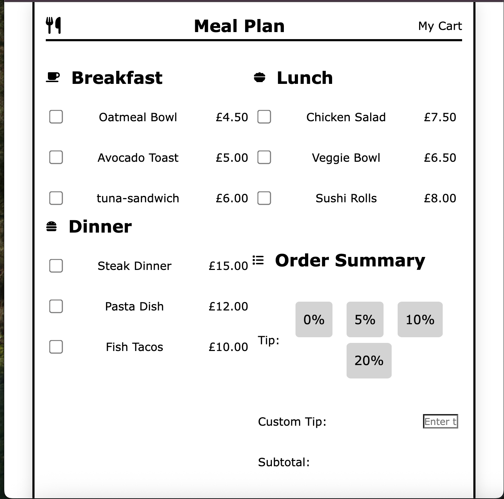

# meal-cart-project

# Meal Cart Tip Calculator

## Project Description

The Meal Cart Tip Calculator is a web-based application that allows users to select meals (breakfast, lunch, or dinner) and calculate tips based on their meal choices. The user can either select a predefined tip percentage or enter a custom tip amount. The app calculates the subtotal, tip amount, and the total amount to be paid. After checkout, a thank-you message is displayed to confirm the order.

## Features

- **Meal Selection:** Users can choose from breakfast, lunch, or dinner options.
- **Tip Calculation:** Users can either select a predefined tip percentage (e.g., 10%, 15%, 20%) or input a custom tip percentage.
- **Subtotal & Total:** The app calculates and displays the subtotal, tip amount, and total amount to pay.
- **Checkout:** After clicking checkout, a "Thank you for your order" message is shown.
- **Data Validation:** Ensures the user inputs valid amounts for both the bill and tip percentages.

## Project Requirements

1. **Bill Amount Input:** Users can enter the total bill amount in pounds (£).
2. **Tip Percentage Input:** Users can select from predefined tip percentages or input a custom percentage.
3. **Calculate Tip:** The tip is calculated based on the bill and the selected percentage.
4. **Display Tip Amount:** The calculated tip is displayed in pounds (£).
5. **Total Amount Display (Optional):** Users can view the total amount (bill + tip) for clarity.
6. **User Input Validation:** Ensure users enter valid, positive numbers for both the bill amount and the tip percentage.

## Example Flow

- **User Inputs Bill:** £56
- **User Selects Tip Percentage:** 15%
- **Displayed Tip:** "Tip: £7.50"
- **Total Amount:** "Total: £63.50"

## How to Run the Project

### Prerequisites

- HTML, CSS, and JavaScript enabled on your browser.

### Steps to run:

1. Download or clone the repository:
   ```bash
   git clone https://github.com/Mayowa-Dimeji/meal-cart-project.git
   ```
   
